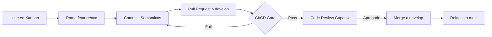
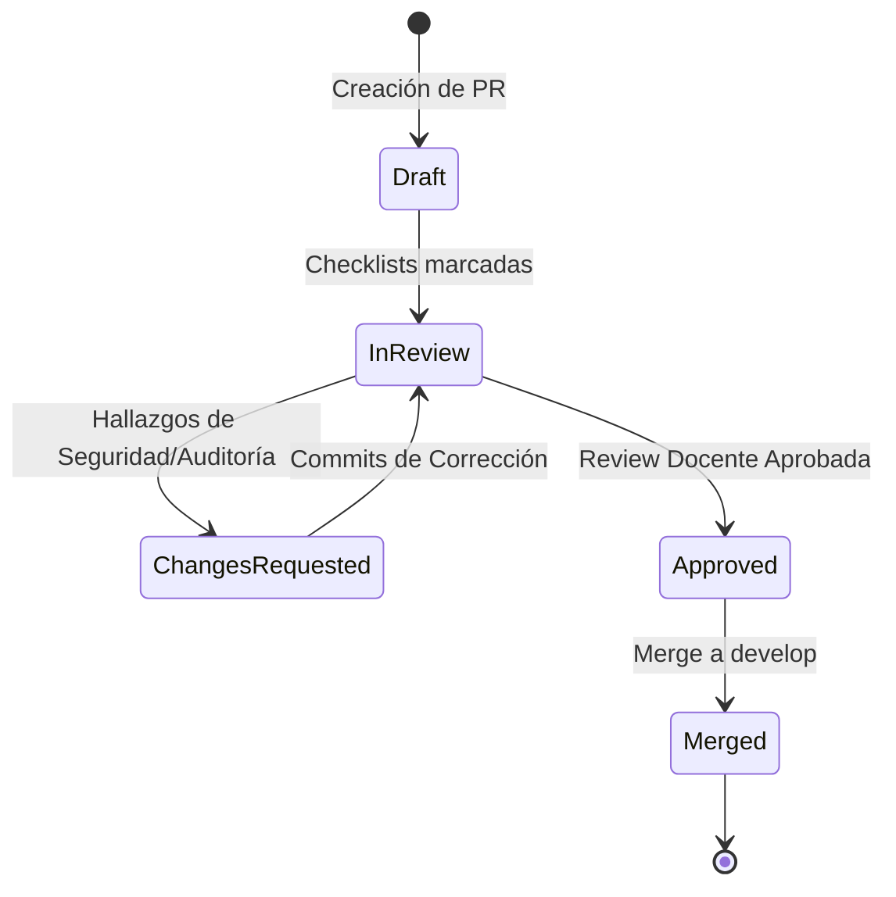

# DIAGRAMAS Y MODELOS DE REFERENCIA EN MERMAID

Este documento contiene los estándares visuales de arquitectura, flujo de trabajo y ciclos de vida obligatorios para el proyecto de PP3.

## 1. Flujo de Trabajo y Git Flow

## 2. Estado de Ciclo de Vida de Pull Requests

