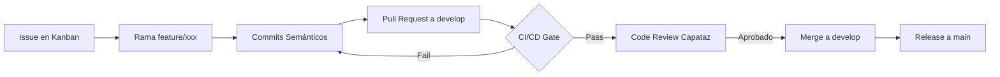
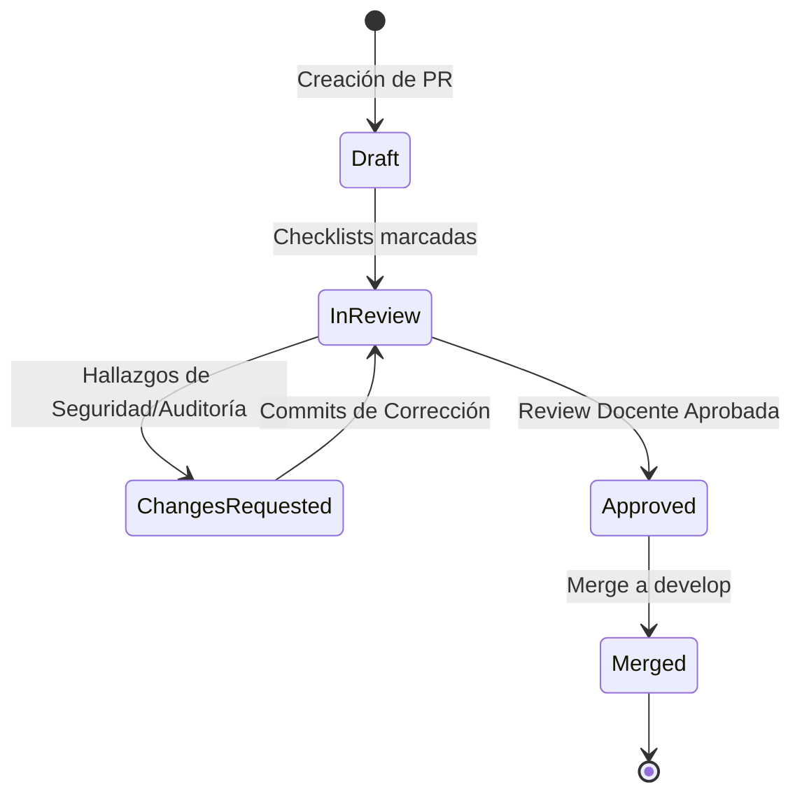

# DIAGRAMAS Y MODELOS DE REFERENCIA EN MERMAID

Este documento contiene los estándares visuales de arquitectura, flujo de trabajo y ciclos de vida obligatorios para el proyecto de PP3.

## 1. Flujo de Trabajo y Git Flow
> **Escenario:** flujo completo con `develop` (repo de coordinación, o repo de alumno que ya adoptó develop). Para el bootstrap del Sprint 1 del alumno (repo recién creado, solo `main`), el PR inicial va a `main`: ver la matriz por escenario en `docs/auditoria/GIT_FLOW_SETUP.md`.

```mermaid
flowchart LR
    A[Issue en Kanban] --> B[Rama feature/xxx]
    B --> C[Commits Semánticos]
    C --> D[Pull Request a develop]
    D --> E{CI/CD Gate}
    E -- Pass --> F[Code Review Capataz]
    E -- Fail --> C
    F -- Aprobado --> G[Merge a develop]
    G --> H[Release a main]
```

## 2. Estado de Ciclo de Vida de Pull Requests
> **Escenario:** aplica a los PRs del repo de coordinación y a los PRs del alumno que use el flujo completo con `develop`.

```mermaid
stateDiagram-v2
    [*] --> Draft: Creación de PR
    Draft --> InReview: Checklists marcadas
    InReview --> ChangesRequested: Hallazgos de Seguridad/Auditoría
    ChangesRequested --> InReview: Commits de Corrección
    InReview --> Approved: Review Docente Aprobada
    Approved --> Merged: Merge a develop
    Merged --> [*]
```
